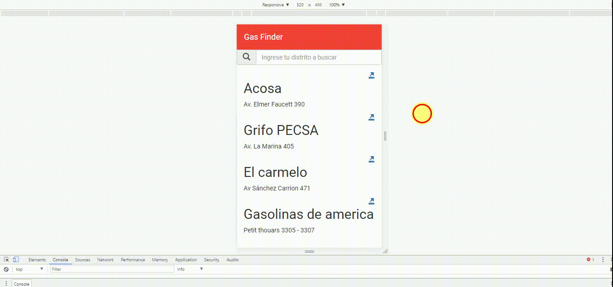

# gasfinder

## Resumen ejecutivo

GasFinder es una aplicación que permite ubicar estaciones de servicios (Primax, Pecsa, etc) en base al distrito ingresado en su buscador.

La aplicación consta de 2 pantallas:

1. La primera pantalla permite realizar la búsqueda de las estaciones de servicio en tiempo real. El sistema debe

2. La segunda pantalla muestra el detalle de la estación de servicio, debe mostrar un mapa y el detalle de la estación.

La aplicación está diseñada exclusivamente para celulares modernos por lo que se espera un diseño responsive entre 400px a 1024px, todo el contenido debe ajustarse a estas dimensiones.

Ver más detalle de la especificación funcional en el siguiente enlace

[https://docs.google.com/presentation/d/1vh5I-6MC-2puAAo-YI-Engsui1F-SomqyYdZaB6f4uQ/edit#slide=id.g1df7a26370_0_134](https://docs.google.com/presentation/d/1vh5I-6MC-2puAAo-YI-Engsui1F-SomqyYdZaB6f4uQ/edit#slide=id.g1df7a26370_0_134)

## Objetivos

1. Construir la pantalla que permita hacer la búsqueda en tiempo real
2. Construir la pantalla que muestre el detalle de la estación
3. Hacer que se vea bien en las diferentes vistas

## Como me veo en desktop

## En mobile

## Patrón de diseño de la aplicación

La principal característica de la aplicación es el uso del patrón de composición de componentes. Los componentes son entidades independientes que retornan elementos jquery los cuales se adjunta al dom para mostrarse.

Además la aplicación maneja un estado compartido (único lugar donde vamos a guardar información que se compartirá entre los distintos componentes).

Además la aplicación tiene algunas funciones extra para cargar la data de la aplicación.

## Librerias externas

Se está incluyendo las siguientes librerias:

- gmaps ([https://hpneo.github.io/gmaps/](https://hpneo.github.io/gmaps/))
- font awesome ([http://fontawesome.io/](http://fontawesome.io/))
- jquery ([https://jquery.com/](https://jquery.com/))
- Boostrap

## Instrucciones

1. Clonar el repositorio hacia tu cuenta personal para empezar con las modificaciones.
2. Crea el componente search
3. Crea el componente stationDetails
4. Crea el componente gmap
